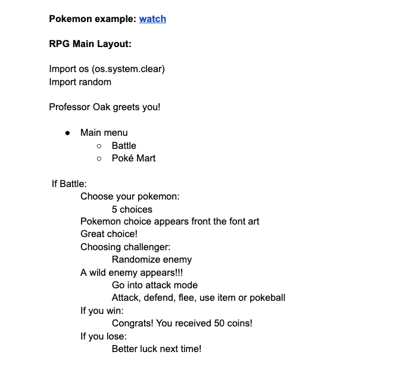
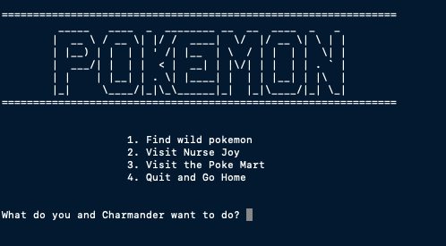
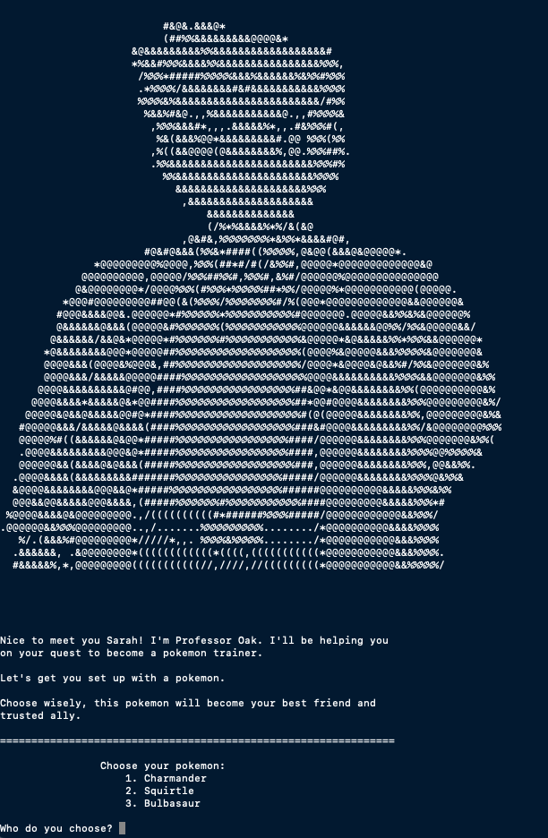

# Week 2- How to Survive Your First Group Project Without Losing Your Sanity

Group projects tend to be a big part of many coding bootcamps as a way for students to practice and develop skills and build their portfolios. As someone who has actively avoided group projects since high school, I was a bit nervous. I wasn’t confident that I could support my group and help them create a product we were proud of. Luckily, I wasn’t alone and my team seemed to have similar woes. At first, we stumbled around together and lost many hours of our lives to figuring out git, but in the end, we created a functional and fun Pokemon game. It took us a day or two to hit our stride, but we eventually figured out the whole group coding thing. Read on to learn how to avoid our mistakes and come out the other end with a great game or project!

## Plan, Execute, Repeat

The first thing we did as a group was create a Google Docs to hold all of our ideas, planning, and checklists. If your group already has a project idea, dive into planning out who the characters or players will be or what your app will do. What makes each character different? What can they do? If your group is developing a small game, it’s also helpful to flesh out the menu options. For example, if you want the player to be able to buy healing potions, how will the player get to that menu and what will it say? Plan as much as you can until your brain hurts and you’ve run out of ideas. If your group decides to go the Google Docs route, create a priorities checklist, an in-progress checklist, and a wishlist. You can even assign roles to certain tasks and honestly, nothing feels better than checking a big task off of a list! After you’ve got your organization down, your group is ready to move on!

### Planning Example:

## Get to Know Git

Before diving into the first group project, I felt like I knew everything about Git and GitHub and that it would be the “easy” part. Well, fast forward to day two of the project, and our entire group is loudly professing their hatred for Git. We lost hours trying to figure out when to merge, how to properly do pull requests, and stressing over using ‘git pull’. It took a bunch of Googling and screen sharing to successfully make it to the weekend with our repo intact. My advice to anyone about to start their first group project is to review Git and practice merging branches and doing pull requests with others. Having a good understanding of Git and GitHub will save you and your team hours!

## Communicate and Have Fun!

My main takeaway from my first group coding project is that communication is KEY. We made sure to keep each other up to date over Slack and planned nightly Zoom meetings to catch up on our progress, update the main game file, and set our goals for the next day. Occasionally, if there was a bug, we’d all set out to fix it and then compare solutions.  Let each other know what you’re struggling with and don’t forget to share the successes too! This constant communication strategy worked for us since we all had the same level of dedication and commitment. If you’re starting a group coding project, remember to take breaks to get to know your teammates, send each other funny gifs or videos, and have fun creating something awesome! 

