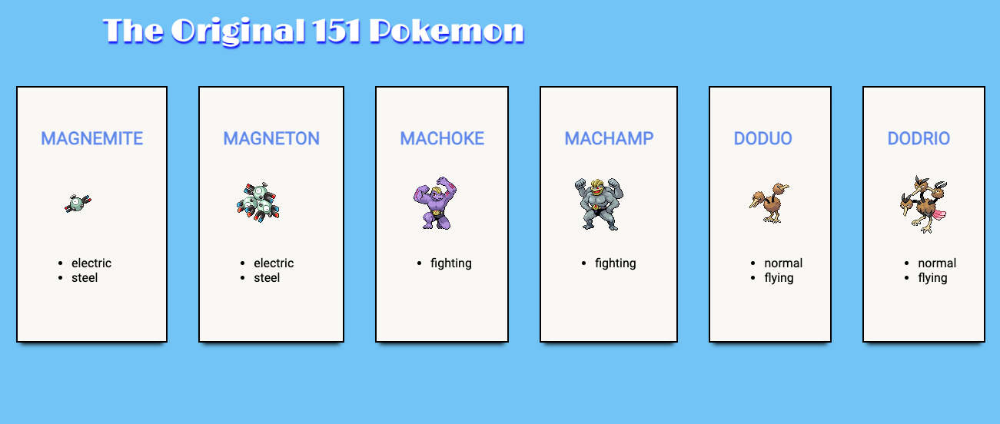
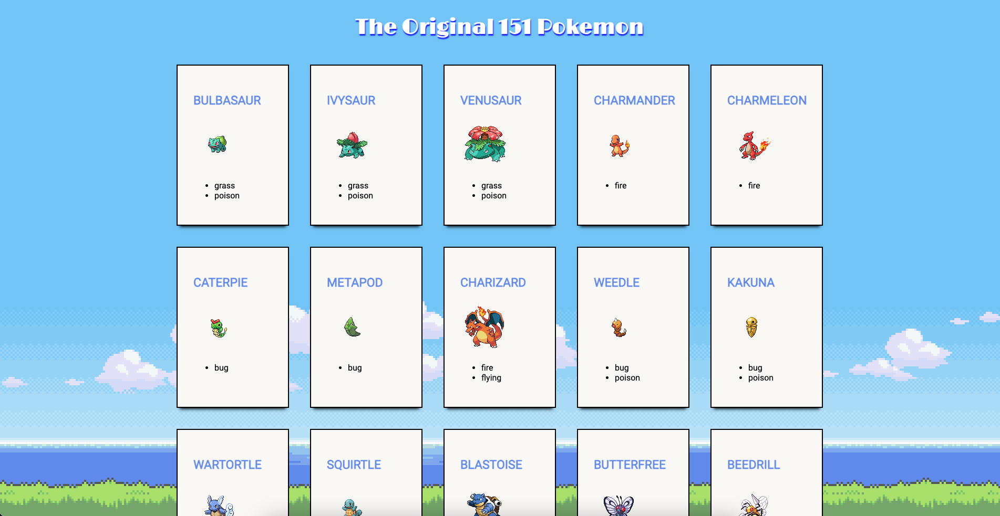

# Building a Small Site Using the PokeApi

This week we learned how to interact with the DOM and started working with various APIs. The biggest challenge for me was understanding all of the new terms like Promises or callbacks. In order to practice and gain a better understanding of the concepts, I decided to create a small webpage using the [PokeApi](https://pokeapi.co/). 

At first glance, the PokeApi seemed a little overwhelming. It is a great API since it contains all the Pokemon information you could ever need, but working with that amount of information was a bit intimidating at first. My first idea was to create a webpage that would allow the user to use a search button to gather information about a particular Pokemon. However, I eventually decided to see if I could have all of the original 151 Pokemon in their own containers with the correct information. 

After fetching all of the information for the 151 Pokemon, I created another function to fetch each individual Pokemon’s data. 

```javascript
 function fetchPokemonData(pokemon) {
        let url = pokemon.url;
        fetch(url).then(function(response) {
            return response.json();
        }).then(function(pokeData) {
            generatePokemon(pokeData);
            console.log(pokeData);
        })
    }
```

After successfully fetching all the data, my next goal was to take the Pokemon’s name, image and types from the correct list and append them to their own div container. It took me a while to figure out how to get each piece of information correctly due to there being so many different arrays in the API. Using the function below, I was able to get the correct information and append it to div elements. 

```javascript
function generatePokemon(pokeData) {

        //Gets Pokemon Name
        const pokeName = document.createElement('h3');
        pokeName.innerText = pokeData.name.toUpperCase();

        //Gets Sprite Image
        const spriteImage = document.createElement('img');
        const spriteImageSrc = pokeData.sprites.front_default;
        spriteImage.src = spriteImageSrc;

        //Gets Types
        const pokeTypes = document.createElement('ul');
        fetchTypes(pokeData.types, pokeTypes); //uses another function to append the type to an ul

        const pokeContainer = document.querySelector('#allPokeContainer');
        const individualContainers = document.createElement('div');
        individualContainers.classList.add('pokeContainers')

        individualContainers.append(pokeName, spriteImage, pokeTypes)
        pokeContainer.appendChild(individualContainers);
    }
```
After creating those functions the only other real challenge was the CSS. Having only worked with flexbox a couple of times, I couldn’t figure out why my boxes looked like this: 



I messed around with adjusting the max-width and creating multiple divs for way too long until I realized the answer was much simpler than I thought. I only needed to add flex-wrap: wrap; to the main container! Hopefully I won’t forget this magical one line of code next time! 



View the full code [here](https://github.com/sarahdepalo/pokemon_api) or the site [here](https://sarahdepalo.github.io/pokemon_api/).
