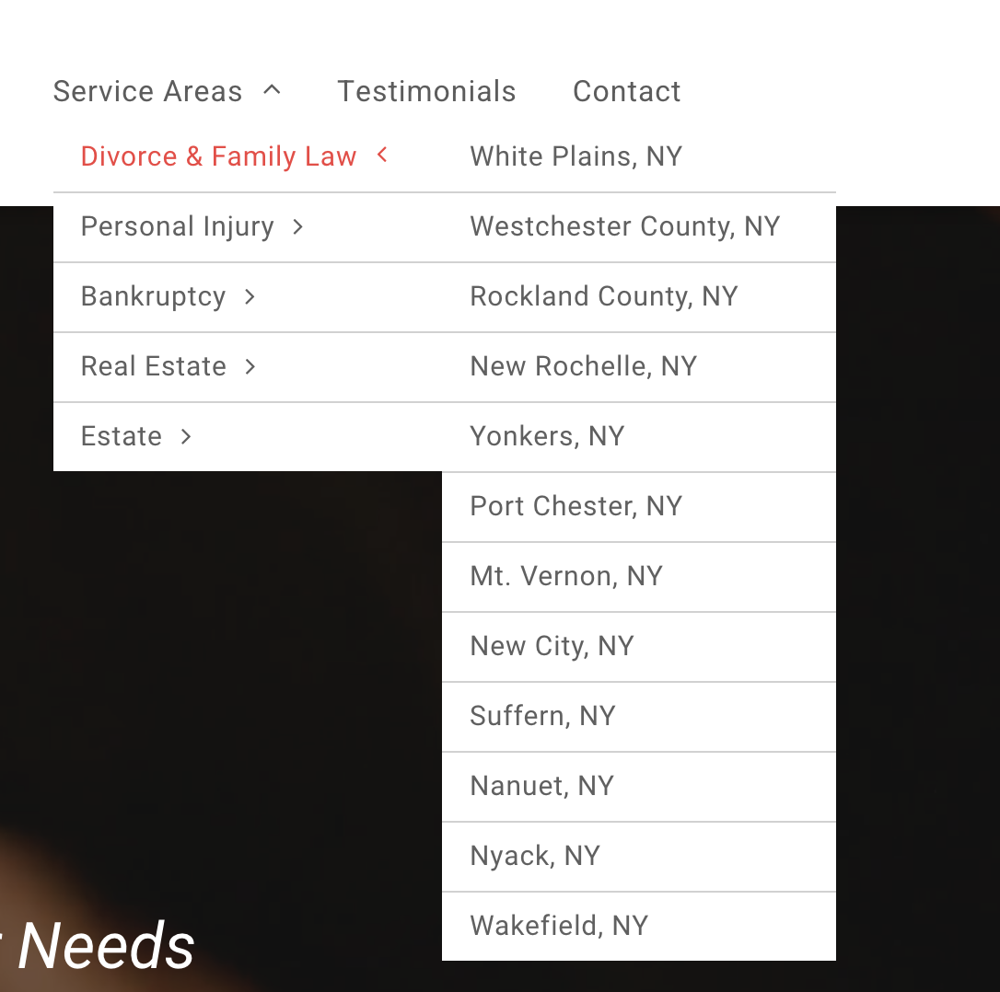

# Week 07 - Introduction to Backend

This week seemed to drag on forever. At the beginning of the week, I was riding the high of completing front-end projects and feeling good. This feeling quickly changed to panic during the middle of the week as I began to question if I’d be able to understand backend programming at all. Node.js and Express came in hot and put me in my place. I was having trouble understanding all the lingo being thrown at me like ‘controller’ or ‘partials’ and got a little lost in the sea of files. 

As a learner, I have to understand how all the little pieces come together and need to do things a LOT to feel comfortable with them. After spending a couple hours each night this week repeating exercises or reading the additional resources, my initial feelings of panic have subsided and I feel a little more confident. At my old job, we worked with databases a little in Duda and Wix as a way to create multiples of the service pages for different zip codes to boost the SEO of the site (I’m sure this is not good practice and not sure it even works lol), but getting a glimpse of how those databases were working this week was really interesting. I’m excited to make applications with databases in the coming week!

As far as whether I prefer front-end or back-end, let’s just say I miss my CSS and making things pretty. 

This is an example of the "SEO Booster" pages made with a database. Each of these would basically be a repeat of the home page with a couple things changed.
        
        
